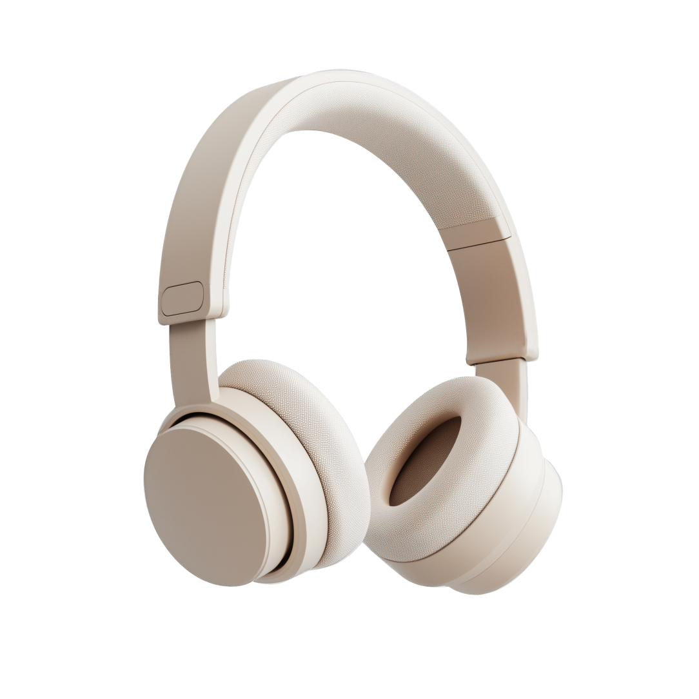

# Resonance - Premium Headphones Landing Page

A responsive landing page for premium headphones built with React and Vite. Features modern design, interactive components, and smooth animations.



## 🎧 Features

- Responsive design that works on desktop and mobile devices
- Interactive product showcase with color picker
- Automatic image carousels with smooth animations
- Technical specifications and product comparison pages
- Custom animations and transitions
- Modern, clean UI with attention to typography and spacing

## 🛠 Technologies

- React 19.1
- React Router 7.9
- React Responsive
- React Icons
- Vite 7.1
- CSS3 with custom properties
- Mobile-first approach

## 🚀 Getting Started

1. Clone the repository:
```bash
git clone https://github.com/CoolZero21/Headphones-Website-react
cd react
```

2. Install dependencies:
```bash
npm install
```

3. Start development server:
```bash
npm run dev
```

4. Build for production:
```bash
npm run build
```

5. Preview production build:
```bash
npm run preview
```

## 📱 Responsive Design

The website is fully responsive with specific optimizations.

Custom components and layouts ensure optimal viewing experience across all devices.

## ✨ Key Components

- `HeroSection`: Main product showcase
- `ColorPickSection`: Interactive color selection
- `FeatureSection`: Product features carousel
- `TechSpecs`: Detailed technical specifications
- `Compare`: Product comparison interface

## 🎨 Design Elements

- Custom gradients and blur effects
- Smooth scroll animations
- Interactive button effects
- Dynamic color selection
- Responsive typography using viewport units
- Masked carousel elements

## 💻 Development Features

- ESLint configuration for code quality
- Hot Module Replacement (HMR)
- Asset optimization
- Production build optimization

## 🔧 Project Structure

```
src/
├── assets/
│   ├── icons/
│   └── images/
├── components/
├── layouts/
├── pages/
└── products.json
```

## 📝 License

This project is intended for learning purposes. You are free to use and modify the code for your own learning and development.

## 🙏 Acknowledgments

- Built with React and Vite
- Icons from React Icons
- Design inspiration from modern web practices